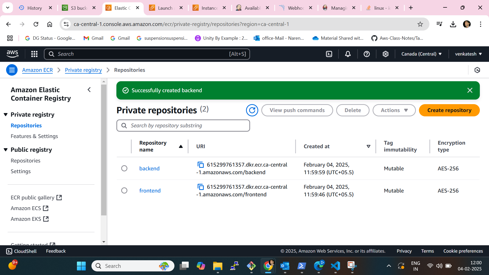
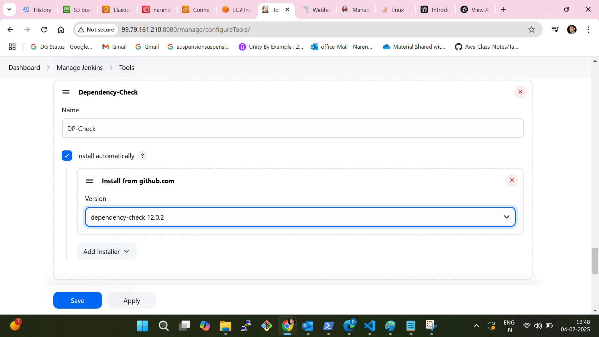
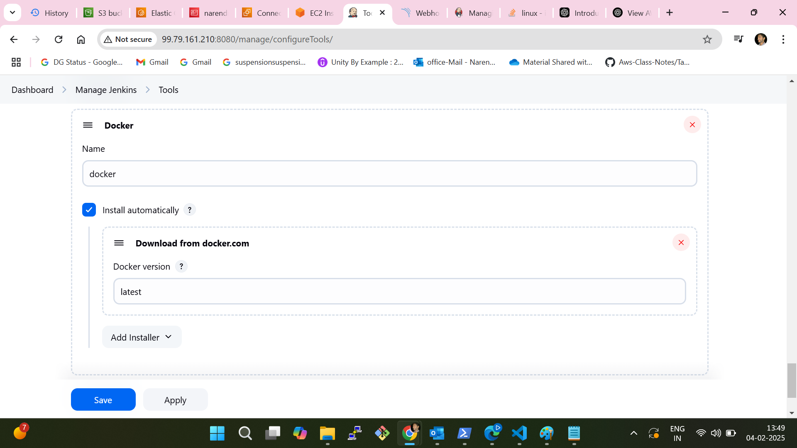

# Three-Tier DevSecOps Full-Stack Web Application Deployment on AWS EKS using ArgoCD, Prometheus, Grafana, and Jenkins
Imagine a robust, secure, and scalable web application built with cutting-edge DevSecOps practices—now imagine achieving all that with automation and efficiency. In this guide, we take you step-by-step through deploying a three-tier web application on AWS EKS using a powerful stack of tools, including ArgoCD, Prometheus, Grafana, Jenkins, Trivy, and SonarQube. 

This article is your blueprint for leveraging AWS services like ECR, S3, DynamoDB, and EC2, with Terraform as the backbone for Infrastructure as Code (IaC). From setting up an IAM user with proper permissions to configuring pipelines for building, scanning, and deploying frontend and backend applications, you'll discover how to create a production-grade system designed for scalability and security. 

Highlights include: 

Pipeline Automation: Build, scan, and deploy Docker images using Jenkins, Trivy, and SonarQube. 

Cluster Monitoring: Install Prometheus and Grafana to monitor application health with visual dashboards. 

GitOps with ArgoCD: Achieve seamless application deployment and updates via Git repositories. 

End-to-End DevSecOps Workflow: Incorporate security scans, monitoring, and scalable infrastructure for a production-ready deployment. 

To make learning even easier, a detailed YouTube video accompanies this guide, walking you through each step visually. Whether you're a DevOps enthusiast or a seasoned cloud professional, this tutorial will help you bridge the gap between theory and practical implementation. 

Youtube Video: 

This article is ideally suited for video, as it contains many commands used in this project. To successfully deploy, I highly recommend watching the video. 

Steps: 

IAM User Setup: Create an IAM user with the necessary permissions for EKS, S3, DynamoDB, ECR, and EC2. 

Terraform & AWS CLI Installation: Install Terraform and AWS CLI on your local machine and configure AWS CLI with IAM credentials. 

S3 Bucket and DynamoDB Table: Set up an S3 bucket for Terraform state files and a DynamoDB table for state locking. 

Infrastructure as Code (IaC): Use Terraform and AWS CLI to set up the Jenkins server (EC2 instance) on AWS. 

Jenkins Server Configuration: With shell script & terraform install Jenkins, Docker, Docker Compose, Terraform, Kubectl, AWS CLI, Trivy, and SonarQube. 

Installing Plugins on Jenkins: Install Jenkins plugins, including AWS Credentials, AWS Steps, Docker plugins, Eclipse Temurin installer, NodeJS, OWASP Dependency-Check, and SonarQube Scanner. 

SonarQube Setup: Integrate SonarQube for code quality analysis within the Jenkins pipeline. 

Amazon ECR Repositories: Create Amazon ECR repositories for frontend and backend images and configure Jenkins to push Docker images to ECR. 

EKS Cluster Deployment: Deploy the EKS cluster with Terraform, including VPC, subnets, security groups, and IAM roles. 

Prometheus and Grafana Installation and Configuration: Use Helm to install Prometheus and Grafana on the EKS cluster and set up monitoring dashboards. 

Jenkins Pipelines (Frontend & Backend): Set up Jenkins pipelines for frontend and backend applications with stages for building, testing, scanning, and deploying. 

ArgoCD Installation & Application Deployment: Install ArgoCD on the EKS cluster and configure it to deploy applications automatically from a Git repository. 

DNS Configuration: Configure DNS to point to the EKS load balancer or Ingress endpoint, and to make applications available on a subdomain using Cloudflare. 

Data Persistence: Implement persistent volume and persistent volume claims for database pods to ensure data persistence. 

Conclusion: Test the end-to-end deployment, verify integrations, and ensure that monitoring, alerting, and scaling settings are in place for production readiness. 

 

1. IAM User Setup 

Create an IAM user with the necessary permissions for EKS, S3, DynamoDB, ECR, and EC2. 

On AWS Console, search I am, and click Users. 

aws console 

 

Next, click Create User 

click create user 

Give a username to your iam User. 

 

IAM user name 

Attach administrative access for testing; for your company project, assign limited policies, and click Create user. 

 

 

Now you can create an access key 

Click Security Credentials, and click on create access key. 

 

access key 

Click Command Line Interface (CLI) 

 

 

Download the file for later use of the secret key and access key. 

 

 

 

We have done now with IAM user creation. 

2. Terraform & AWS CLI Installation 

To install Terraform, You can visit Terraform official website. 

To install AWS CLI, You can Visit AWS installtion page. 

 

After installation, you can verify installation with these two commands 

terraform --version 

aws --version         

Then configure aws CLI using the given blow commands, Use Access and secret key from the CSV file you download in the IAM User step. 

aws configure         

 

 

3. S3 Bucket and DynamoDB Table 

As S3 Bucket and Dynamo DB are required for Terraform's backend state, you can create them by watching my video. 

S3 bucket can be any, give any unique name to it. 

lock-files name will be DynamoDB table, and the partition key will be LockID. 

 

 

4. Jenkins EC2 Server Setup with Terraform 

 

Clone the git repo. 

git clone https://github.com/codewithmuh/three-tier-devsecops-project.git         

Go to the folder jenkins-server-terraform in the terminal. 

Just make sure to make changes in backend.tf file. Update the name of the s3 bucket and dynamo db name. 

Next, we have to run the command to create .pem file for our Jenkins instance. will be used to ssh the server. 

 

 aws ec2 create-key-pair --key-name devsecops-project --query "KeyMaterial" --output text > devsecops-project.pem         

Now run this command to create a Jenkins server. 

terraform init 

terraform validate 

terraform apply         

Now ssh to your server : 

Make sure you run these commands from the folder where your pem file exist. 

chmod 400 "devsecops-project.pem" 

 

ssh -i "devsecops-project.pem" ubuntu@35.92.246.29         

configure aws on the Jenkins server(EC2 Instance). As you did for your local machine. 

aws configure         

5. Installing Plugins on Jenkins 

Open the EC2-IP:8080 in the browser. 

You can get the password of Jenkins 

 sudo cat /var/lib/jenkins/secrets/initialAdminPassword         

Install recommended plugins. 

After creating Jenkins accounts, go to manage Jenkins -> plugins -> available plugins 

We have to install all these mentioned plugins. 

AWS Credentials 

AWS Steps 

Docker plugins 

Eclipse Temurin installer 

NodeJS 

OWASP Dependency-Check, 

SonarQube Scanner.         

6. SonarQube Setup: 

Open Sonarrqube in the browser. 

http://<jenkins-server-public-ip>:9090 

username and password for sonarqube is admin. 

 

Next, We have to perform 5 Steps on the sonarqube setup. 

Setup of frontend project for code analysis 

Setup of backend project for code analysis 

Replace the keys in jenkins-pipeline folder, you got from the above two steps. (watch video sonarqube setup) 

create a sonar-token, and save it somewhere for later use in Jenkins. 

create a webhook on the sonarqube dashboard. (http://<jenkins-ec2-server-public-ip>:8080/sonarqube-webhook/) 

 

7. Amazon ECR Repositories 

Create two repositories, one for the backend and front end. 

 

 

  

   

 

Login to ECR on the Jenkins server, using the ECR push command. 

 

 

 

7a. Add Cred. in Jenkins 

 

Got to Manage Jenkins -> Credentials. 

We have to add here a total of 7 Credentials. 

aws-key 

GITHUB (username & Password) 

 
 
github (secret text) 

 

sonar-token 
   

  
 

 

ECR_REPO_FRONTEND 

ECR_REPO_BACKEND 

 

ACCOUNT_ID (aws account id)   

Now We have to configure the installed plugins.
 (important) 

 
 

In Tools, We have to configure JDK, sonar-scanner, nodejs, DP-Check, and docker. 

  

 

 

 

 

 

 

 

 

 

Go to Dashboard -> Manage Jenkins -> System 

Search for SonarQube installations 
 

Provide the name as it is, then in the Server URL copy the sonarqube public IP (same as Jenkins) with port 9000 select the sonar token that we have added recently, and click on Apply & Save. 

8. EKS Cluster Deployment

 

We have to create EKS Cluster using the below commands. 

 eksctl create cluster --name three-tier-k8s-eks-cluster --region us-west-2 --node-type t2.medium --nodes-min 2 --nodes-max 2 

   

 

Once the cluster is ready, you can validate if the nodes are ready or not. 

kubectl get nodes  

        

Now, we will configure the Load Balancer on our EKS because our application will have an ingress controller. 

Download the policy for the LoadBalancer prerequisite. 

curl -O https://raw.githubusercontent.com/kubernetes-sigs/aws-load-balancer-controller/v2.5.4/docs/install/iam_policy.json         

 

  

Create the IAM policy using the below command 

aws iam create-policy --policy-name AWSLoadBalancerControllerIAMPolicy --policy-document file://iam_policy.json   

Create OIDC Provider 

eksctl utils associate-iam-oidc-provider --region=us-west-2 --cluster=three-tier-k8s-eks-cluster --approve   

Create a Service Account by using below command and replace your account ID with your one 

eksctl create iamserviceaccount --cluster=my-three-tier-k8s-eks-cluster --namespace=kube-system --name=aws-load-balancer-controller --role-name AmazonEKSLoadBalancerControllerRole --attach-policy-arn=arn:aws:iam::<your-account-id>:policy/AWSLoadBalancerControllerIAMPolicy --approve --region=us-west-2    

Run the below command to deploy the AWS Load Balancer Controller 

helm repo add eks https://aws.github.io/eks-charts 

helm repo update eks 

helm install aws-load-balancer-controller eks/aws-load-balancer-controller -n kube-system --set clusterName=three-tier-k8s-eks-cluster --set serviceAccount.create=false --set serviceAccount.name=aws-load-balancer-controller   

After 2-3 minutes, run the command below to check whether your pods are running or not. 

kubectl get deployment -n kube-system aws-load-balancer-controller   

 

 

 

9. Prometheus and Grafana Installation and Configuration 

What is Grafana? 

Grafana is an open-source platform for visualization and analytics. It allows you to query, visualize, alert on, and explore metrics from various data sources. 

Steps to Install and Configure Prometheus and Grafana on Kubernetes 

Step 1: Add Helm Repositories 

Add Helm Stable Chart Repository 

helm repo add stable https://charts.helm.sh/stable         

2. Add Prometheus Community Helm Repository 

helm repo add prometheus-community https://prometheus-community.github.io/helm-charts  

Step 2: Create a Namespace for monitoring 

 

 

  

  

kubectl create namespace monitoring 

Step 3: Install Prometheus with Grafana using Helm 

Install the kube-prometheus-stack chart, which includes both Prometheus and Grafana: 

helm install stable prometheus-community/kube-prometheus-stack -n monitoring         

This command deploys Prometheus and Grafana as part of the kube-prometheus-stack in the prometheus namespace on your EC2 instance. 

Step 4: Verify Prometheus Installation 

Check the Prometheus pods: 

kubectl get pods -n monitoring         

Check the Prometheus services: 

kubectl get svc -n monitoring         

Since Grafana is deployed along with Prometheus, there is no need for separate Grafana installation. 

Step 5: Expose Prometheus and Grafana to External Access 

There are two ways to expose these services: 

NodePort 

LoadBalancer 

Exposing Prometheus via LoadBalancer: 

kubectl edit svc stable-kube-prometheus-sta-prometheus -n monitoring         

Save the file. The service should now have a load balancer with an external IP to access Prometheus. 

Exposing Grafana via LoadBalancer: 

Similarly, edit the Grafana service configuration to change ClusterIP to LoadBalancer: 

kubectl edit svc stable-grafana -n monitoring         

Save the changes and use the load balancer IP in your browser to access Grafana. 

Step 6: Accessing Grafana 

The username will be admin and the password will be prom-operator for your Grafana LogIn. 

 

step of the Grafana dashboard with Prometheus as explained in the video. 

 

9. Jenkins Pipelines (Frontend & Backend) 

This step do not include any commands, you can watch it in my video. 

 

10. ArgoCD Installation & Application Deployment 

kubectl create namespace three-tier         

kubectl create secret generic ecr-registry-secret \ 

  --from-file=.dockerconfigjson=${HOME}/.docker/config.json \ 

  --type=kubernetes.io/dockerconfigjson --namespace three-tier 

kubectl get secrets -n three-tier         

 

Now, we will install argoCD. 

To do that, create a separate namespace for it and apply the argocd configuration for installation. 

 

kubectl create namespace argocd 

kubectl apply -n argocd -f https://raw.githubusercontent.com/argoproj/argo-cd/v2.4.7/manifests/install.yaml         

All pods must be running, to validate run the below command 

kubectl get pods -n argocd         

Now, expose the argoCD server as LoadBalancer using the below command 

kubectl patch svc argocd-server -n argocd -p '{"spec": {"type": "LoadBalancer"}}'         

 

You can validate whether the Load Balancer is created o by going to the AWS Console load balancers. 

To access the argoCD, copy the LoadBalancer DNS CNAME record and hit on your favorite browser. 

Now, we need to get the password for our argoCD server to perform the deployment. 

To do that, we have a pre-requisite which is jq. Install it by the command below. 

sudo apt install jq -y         

export ARGOCD_SERVER=$(kubectl get svc argocd-server -n argocd -o json | jq -r '.status.loadBalancer.ingress[0].hostname') && export ARGO_PWD=$(kubectl -n argocd get secret argocd-initial-admin-secret -o jsonpath="{.data.password}" | base64 -d) && echo "ARGOCD_SERVER: $ARGOCD_SERVER" && echo "ARGO_PWD: $ARGO_PWD"         

Next will deploy our Three-Tier Application using ArgoCD 

As our repository is private. So, we need to configure the Private Repository in ArgoCD.

Then We have to set up applications. 

1. database 

2. backend 

3. frontend 

4. frontend-ingress 

5. backend-ingress         

 

11. DNS Configuration 

This step do not include any commands, you can watch it in my video. 

12. Conclusion 

We have set up a Persistent Volume and a Persistent Volume Claim. This means that if the pods are deleted, the data will not be lost, as it will be stored on the host machine. 

 

Extra: Clean up Everything. If you did this project for testing. To avoid costs on AWS. 

 

First, you must delete your EKS Cluster, Run this command on your Jenkins server. 

eksctl delete cluster --name three-tier-k8s-eks-cluster --region us-west-2 --wait --timeout 30m         

Note: If you encounter any errors related to the load balancer, you will need to delete the frontend and backend load balancers first, then delete your cluster. You can use ChatGPT to learn how to delete your load balancer. 

 

When the cluster is deleted successfully. 

Then On the Local machine, destroy the infrastructure in your terminal at folder jenkins-server-terraform 

terraform destroy         

Finally, you can delete your S3 bucket, DynamoDB, and your IAM user. 

 